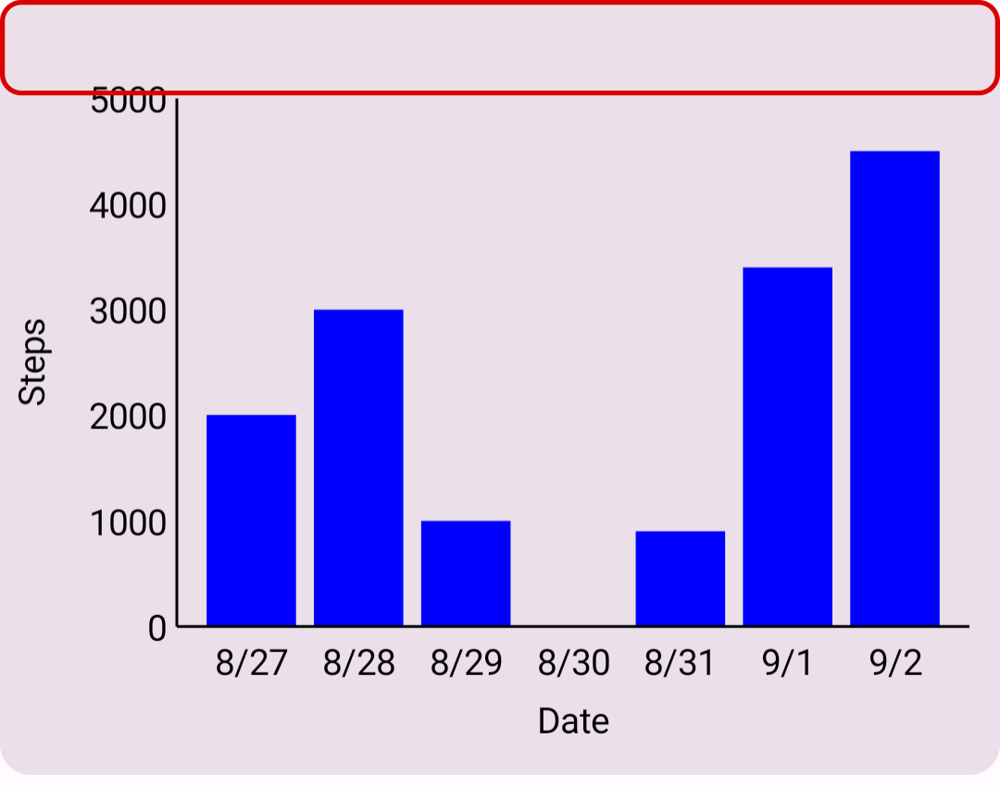
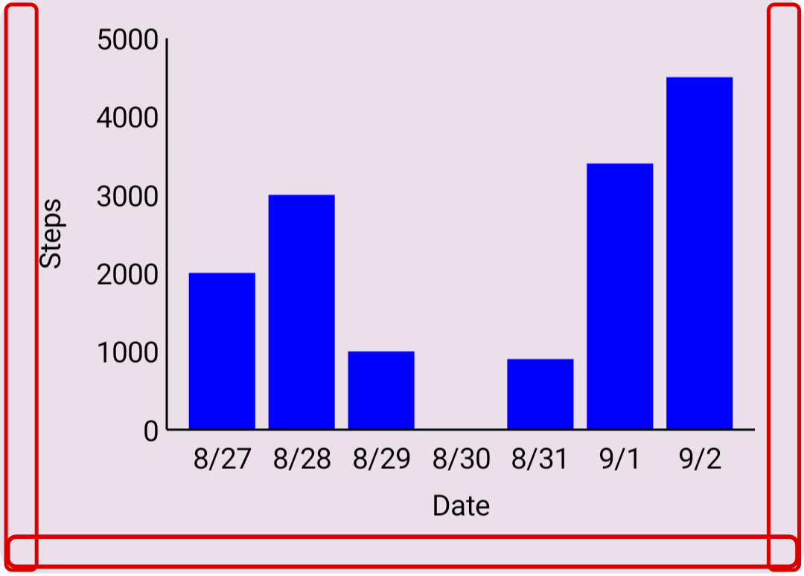
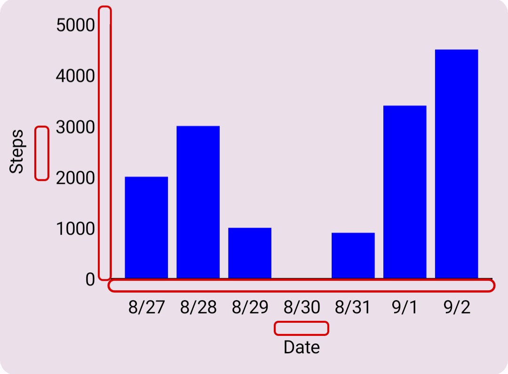
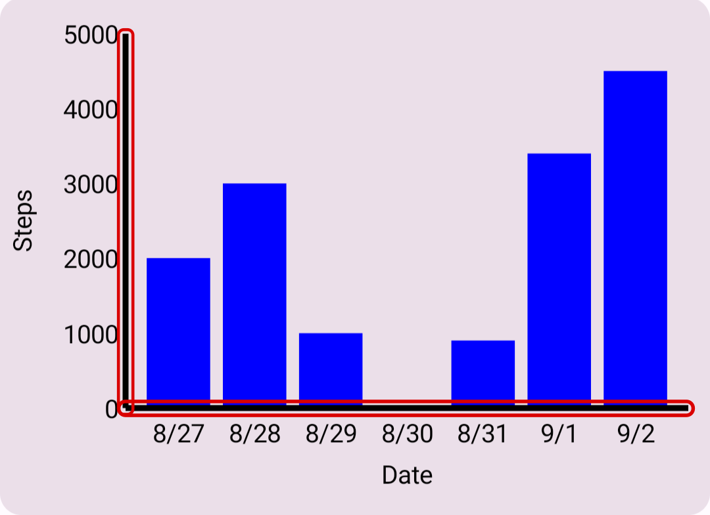
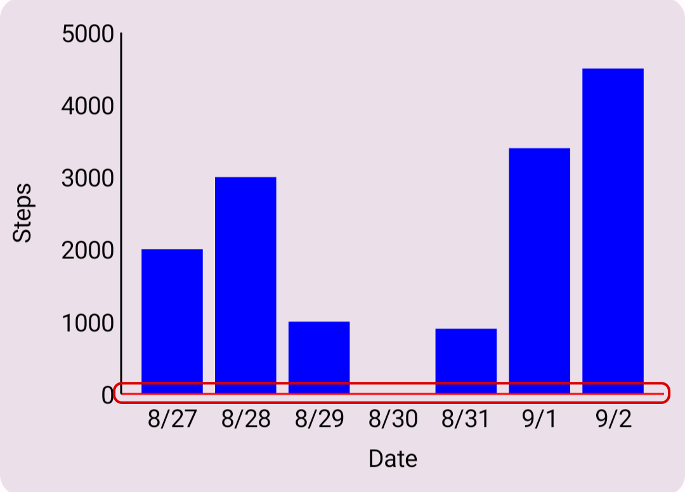
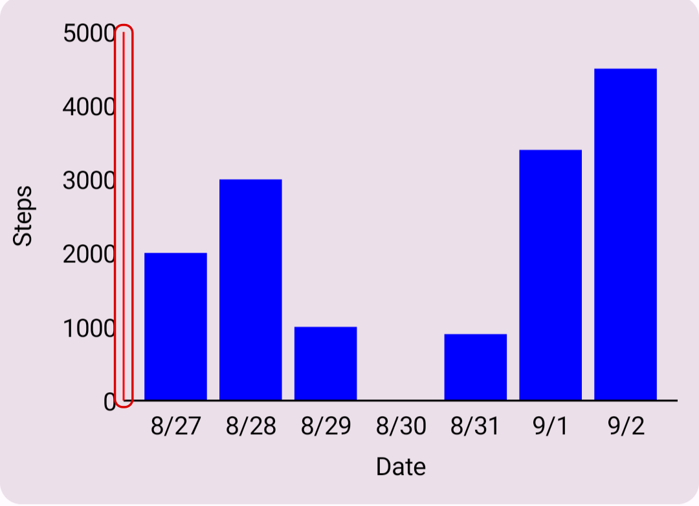
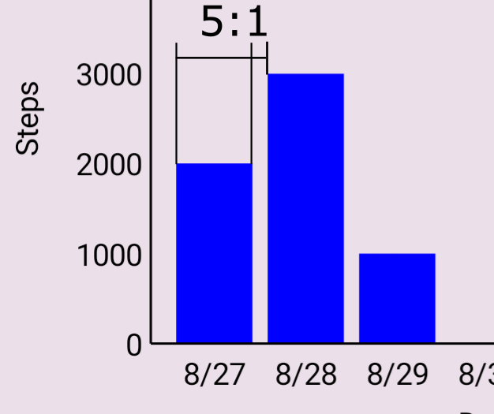
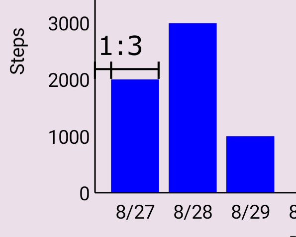
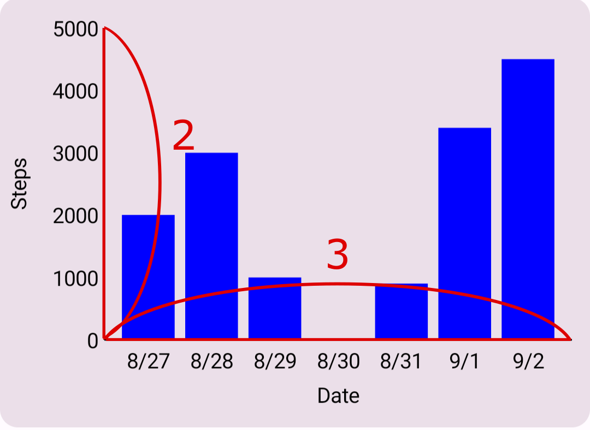

# android-compose-bar-chart-sample(最小限の実装)

JetpackComposeのCanvasを使用したグラフ描画のサンプルコードです。グラフの内容がはみ出さないようにグラフの寸法を決めました。

## 想定環境
使用言語: Kotlin  
Android Studio Giraffe | 2022.3.1  
OS: Windows 11  
minSdkVersion: 26  
targetSdkVersion: 33  

## アプリのメイン画面


## グラフの見た目を変える変数

### グラフの寸法値
```kotlin
// dimension value
val width = constraints.maxWidth
val topChartAreaGap = convertDpToPx(20f, context)
val chartAreaGap = convertDpToPx(12f, context)
val textGap = convertDpToPx(4f, context)
val axisStrokeWidth = 3f
```
#### グラフの上部の空白



```kotlin
val topChartAreaGap = convertDpToPx(20f, context)
```

#### グラフの下と左右の空白



```kotlin
val chartAreaGap = convertDpToPx(12f, context)
```

#### テキストと他の要素の間の空白



```kotlin
val textGap = convertDpToPx(4f, context)
```

#### 軸の線の幅



```kotlin
val axisStrokeWidth = 3f
```

### グラフの軸の色
```kotlin
// color
val xAxisColor: Color = Color.Black
val yAxisColor: Color = Color.Black
```

#### x軸の線の色



```kotlin
val xAxisColor: Color = Color.Black
```

#### y軸の線の色



```kotlin
val yAxisColor: Color = Color.Black
```

### グラフの寸法の比
```kotlin
// ratio
// ratio of bar to gap between bar and bar
val ratioOfBarToGap = 5f / 1f
// ratio of bar to gap between bar and axis
val ratioOfBarToAxisGap = 3f / 1f
// aspect ratio of chart area
val chartAspectRatio = 2f / 3f
```

#### グラフの棒と、棒と棒の間の空白の寸法の比



```kotlin
// ratio of bar to gap between bar and bar
val ratioOfBarToGap = 5f / 1f
```

#### グラフの棒と、縦軸と棒の間の空白の寸法の比



```kotlin
// ratio of bar to gap between bar and axis
val ratioOfBarToAxisGap = 3f / 1f
```

#### グラフの縦横の寸法の比



```kotlin
// aspect ratio of chart area
val chartAspectRatio = 2f / 3f
```

## グラフのデータ

```kotlin
val dataY = listOf(
    2003,
    3000,
    1000,
    0,
    902,
    3400,
    4502
)
val dataX = listOf(
    "8/27",
    "8/28",
    "8/29",
    "8/30",
    "8/31",
    "9/1",
    "9/2"
)
```

### x軸データ
```kotlin
val dataX = listOf(
    "8/27",
    "8/28",
    "8/29",
    "8/30",
    "8/31",
    "9/1",
    "9/2"
)
```

### y軸データ
```kotlin
val dataY = listOf(
    2003,
    3000,
    1000,
    0,
    902,
    3400,
    4502
)
```

## グラフの軸ラベル

```kotlin
// text of axis
val yAxisText = "Steps"
val xAxisText = "Date"
```

### x軸ラベル
```kotlin
val xAxisText = "Date"
```

### y軸ラベル
```kotlin
val yAxisText = "Steps"
```

## 参考サイト
このサンプルコードでは以下のサイトを参考にしました。

* グラフの軸の目盛りの値を自動計算するアルゴリズム

https://qiita.com/yo16/items/ea620dc234286130e348

* dpとpxを相互変換する方法

https://qiita.com/SnowMonkey/items/6edcd875d78913c50d62


