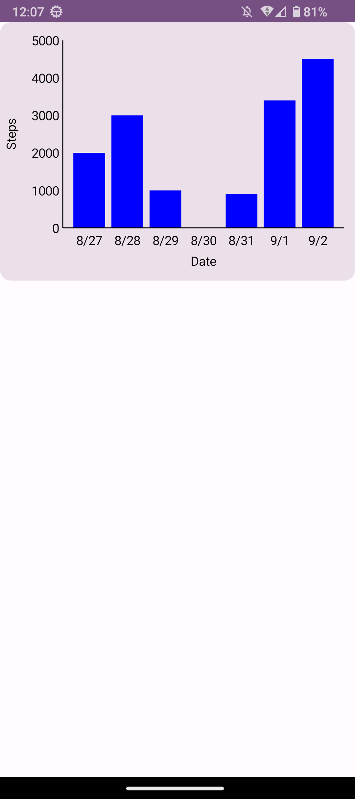

# android-compose-bar-chart-sample(最小限の実装)

JetpackComposeのCanvasを使用したグラフ描画のサンプルコードです。グラフの内容がはみ出さないようにグラフの寸法を決めました。

## 想定環境
使用言語: Kotlin  
Android Studio Giraffe | 2022.3.1  
OS: Windows 11  
minSdkVersion: 26  
targetSdkVersion: 33  

## アプリのメイン画面

## 参考サイト
このサンプルコードでは以下のサイトを参考にしました。

* グラフの軸の目盛りの値を自動計算するアルゴリズム

https://qiita.com/yo16/items/ea620dc234286130e348

* dpとpxを相互変換する方法

https://qiita.com/SnowMonkey/items/6edcd875d78913c50d62

